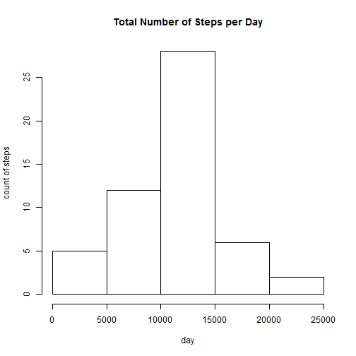
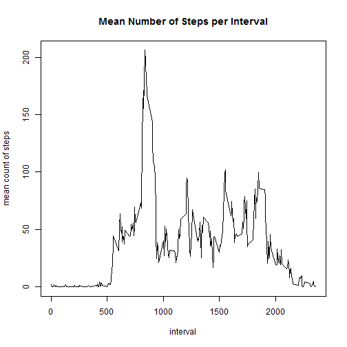
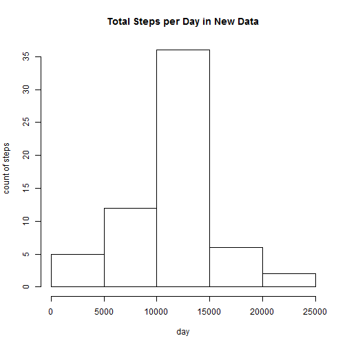
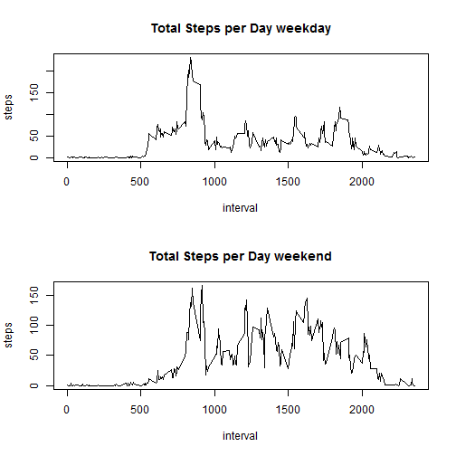

##1.Load the data
Activity monitoring data from the course website has been downloaded.It is first read into data frame df


```r
df<-read.csv("./data/RepData/activity.csv")
```
##2. Preprocess the data
First eliminate nas. Then create and add a variable to shows days from start where 2012-10-01 = 1. 


```r
###select complete cases
df2<-df[complete.cases(df),]
### create variable showing days from start 2012-10-01 = 1
x<-as.numeric(df2$date)
### make day into factor variable
day<-as.factor(x)
### add day as column in data frame
df3<-cbind(df2,day)
```

##3. Find mean number of steps taken per day and produce histogram.


```r
### produce variable summing steps on each day
sumsteps<-tapply(df3$steps,df3$day,sum)
hist(sumsteps,main="Total Number of Steps per Day",ylab="count of steps", xlab="day")
```

 

Find mean of number of steps per day


```r
mean(sumsteps)
```

```
## [1] 10766.19
```

Find median of number of steps per day


```r
median(sumsteps)
```

```
## [1] 10765
```

##4. The daily activity pattern
Derive mean steps per interval averaged over days.
Plot the result using the plot variable.


```r
####calculate mean steps per interval
###create factor variable for interval
interval2<-as.factor(df3$interval)
### add interval2 to new dataframe df4
df4<-cbind(df3,interval2)
### produce variable giving mean steps per interval
meansteps<-tapply(df4$steps,df4$interval2,mean)
###make plot of mean steps per interval
v<-as.vector(meansteps)
i<-unique(df3$interval)
plot(i,v,type="l",main="Mean Number of Steps per Interval",ylab="mean count of steps", xlab="interval")
```

 

```r
####
```

##5. Impute missing values

First identify and count missing values (nas). Then replace nas with the mean value for that interval.


```r
####count nas 
sum(is.na(df$steps))
```

```
## [1] 2304
```

Use dplyr for next part. Create new copy of data frame for activity. Set date as a date variable. 
Find mean values of steps per interval.
Create variable which identifies location of nas by interval.
Match and replace nas with mean value of steps for the interval.


```r
### create new dataset with missing data replaced by interval mean
### make new data frame with date format variable in df
dfn<-df
dfn$date<-as.Date(dfn$date)

### using dplyr create data frame with mean steps per interval
library(dplyr)
```

```
## Warning: package 'dplyr' was built under R version 3.2.2
```

```
## 
## Attaching package: 'dplyr'
## 
## The following objects are masked from 'package:stats':
## 
##     filter, lag
## 
## The following objects are masked from 'package:base':
## 
##     intersect, setdiff, setequal, union
```

```r
meanstepsn<-summarise(group_by(dfn,interval),steps=mean(steps,na.rm=TRUE))
###find intervals with na values
nasteps_interval<-dfn[is.na(dfn$steps),3]
###match intervals
intervals_match<-match(nasteps_interval,meanstepsn$interval)
replacemeansteps<-meanstepsn[intervals_match,2]
###make copy of data frame and replace
newdfn<-dfn
newdfn[is.na(newdfn$steps),1]<-replacemeansteps
```

Make histogram of total steps per day with new data set


```r
### using dplyr find new total steps per day
sumstepsnew<-summarise(group_by(newdfn,date),steps=sum(steps))
hist(sumstepsnew$steps,main="Total Steps per Day in New Data",ylab="count of steps", xlab="day")
```

 

Find mean and median for new data set


```r
mean(sumstepsnew$steps)
```

```
## [1] 10766.19
```

```r
median(sumstepsnew$steps)
```

```
## [1] 10766.19
```

It is noteworthy that the mean and median are the same. This is because the nas were replaced with mean values and the median would have corresponded with one of these mean values for a day with all nas.

##6. Differences between weekdays and weekends.

Insert day variable into activity data frame. Make subsets of weekday and weekend results. Produce variables for means in weekend and weekday datasets. Then plot results.


```r
####look at differences between weekdays and weekends
newdfn$date<-as.Date(newdfn$date)
###insert day as variable showing day of week
newdfn$day<-weekdays(newdfn$date)
###subset weekend and weekday sets from newdfn
newdfnwend<-filter(newdfn,grepl('Saturday|Sunday',day))
newdfnwday<-filter(newdfn,!grepl('Saturday|Sunday',day))
###calculate means and plot results
meanstepswkend<-summarise(group_by(newdfnwend,interval),steps=mean(steps))
meanstepswkday<-summarise(group_by(newdfnwday,interval),steps=mean(steps))
par(mfrow=c(2,1))
plot(meanstepswkday$interval,meanstepswkday$steps,type="l",main="Total Steps per Day weekday",ylab="steps",xlab="interval")
plot(meanstepswkend$interval,meanstepswkend$steps,type="l",main="Total Steps per Day weekend",ylab="steps",xlab="interval")
```

 


